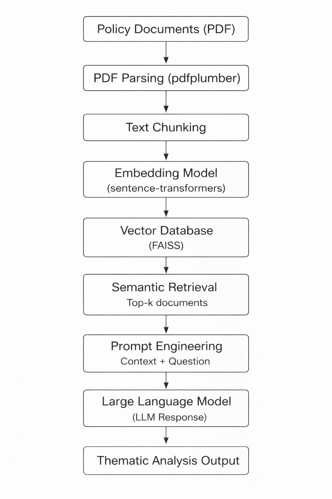

# policy-rag-llm-analysis

This project demonstrates an **AI-powered pipeline for semantic analysis of policy documents** using **Retrieval-Augmented Generation (RAG)** and **Large Language Models (LLMs)**. 

The system processes policy PDFs, converts them into vector embeddings, retrieves relevant context using semantic search, and generates structured thematic insights using an LLM.

The goal of this project is to illustrate how **AI/ML models, vector databases, and LLM orchestration frameworks** can be integrated to support **policy analysis and decision-making**.

---

## Key Features

- **End-to-End RAG Pipeline:** Context-aware document analysis using LangChain.
- **Advanced Semantic Search:** High-performance retrieval via **FAISS** vector indexing.
- **Policy Network Visualization:** Mapping relationship between policy themes using **NetworkX**.
- **Metadata-Driven Retrieval:** Structured chunking to maintain document hierarchy.
- **Bilingual Analysis:** Capability to process and analyze Indonesian policy contexts.

---

## Tech Stack

- **Languages:** Python (Pandas, NumPy)
- **AI/LLM Frameworks:** LangChain, Google Gemini API / HuggingFace
- **Embeddings & Vectors:** Sentence Transformers, FAISS
- **Visualization:** NetworkX, Matplotlib, Seaborn
- **Document Processing:** pdfplumber

---
## Requirements

This project was developed using **Python 3.10+**.

Install all dependencies using:

```bash
pip install -r requirements.txt
```
---

## Pipeline Architecture

<p align="center">
  
</p>

The system processes policy documents through several stages:

1. **PDF Parsing** – Extract text from policy documents.  
2. **Text Chunking** – Split long documents into manageable semantic units.  
3. **Embedding Generation** – Convert text chunks into vector embeddings.  
4. **Vector Storage** – Store embeddings in a **FAISS vector database**.  
5. **Semantic Retrieval** – Retrieve the most relevant document chunks based on user queries.  
6. **Prompt Engineering** – Combine retrieved context with analytical questions.  
7. **LLM Inference** – Generate structured insights using a large language model.  
8. **Thematic Analysis Output** – Produce synthesized findings for policy analysis.

---

## Use Case

This project demonstrates how **LLM-based retrieval systems** can support:

- Policy and governance analysis  
- Knowledge extraction from unstructured documents  
- AI-assisted decision support systems

---

## Future Improvements

- Deploy the pipeline using **FastAPI** for production APIs
- Integrate scalable vector databases such as **Pinecone**
- Implement **LLM fine-tuning for domain-specific policy analysis**
- Add **MLOps pipeline for monitoring and deployment**

## Experimental Notebook

The initial development and experimentation of the RAG pipeline
was conducted in:

notebooks/eksperimen.ipynb

The modules in `src/` represent a modularized version of the
experimental pipeline implemented in the notebook.

## How to Run

1. Clone the repository

git clone https://github.com/nbilaasvv/policy-rag-llm-analysis
cd policy-rag-llm-analysis


2. Install dependencies

pip install -r requirements.txt


3. Configure environment variables

Create a `.env` file:

GOOGLE_API_KEY=your_api_key_here


4. Build the vector database

python src/build_database.py


5. Run RAG queries

python main.py
---

